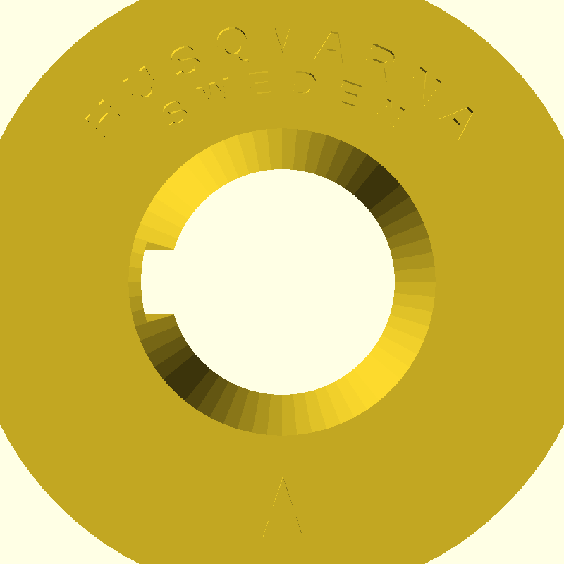
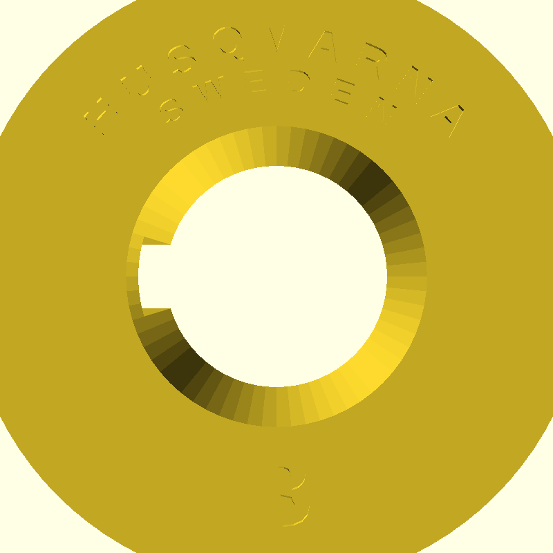
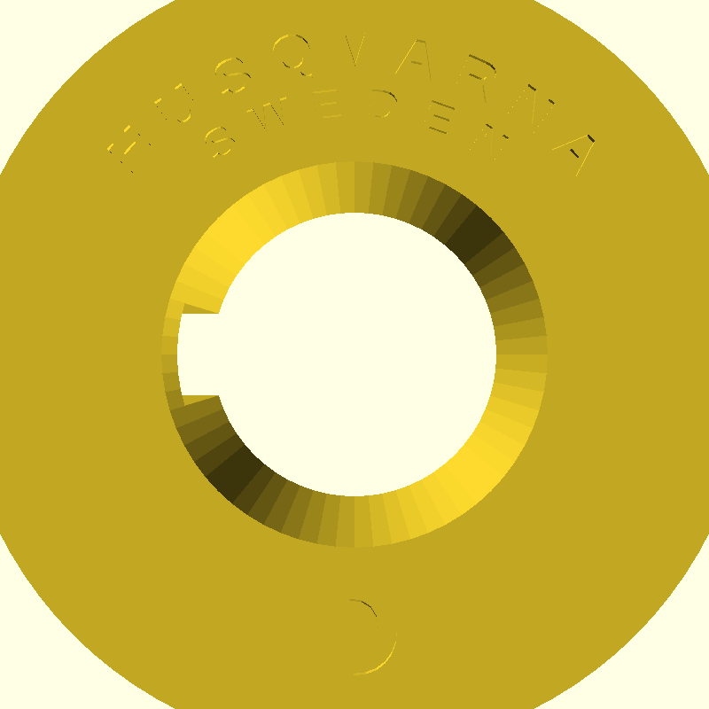

# Generator bębnów ściegowych do Husqvarna 21E / Husqvarna 21E Stitch Drum Generator

*Dokument dwujęzyczny — polski niżej, English below. / Bilingual document — Polish first, English below.*

---

## PL

Otwarty **generator** bębnów ściegowych (stitch cams) do maszyny **Husqvarna 21E**
(rodzina mechanizmu obejmuje też pokrewne oznaczenia: 19, 20, 21A). Nie jest to
zamknięty zestaw czterech wzorów — to parametryczna biblioteka OpenSCAD, w której
mocowanie jest raz zweryfikowane i wspólne, a Ty projektujesz dowolną liczbę
własnych wzorów ściegów. Patrz [`docs/CREATING_NEW_DRUMS.md`](docs/CREATING_NEW_DRUMS.md).

### Cel

Zestaw A jest już zaprojektowany: [Viking 21a Basic Stitch Cam](https://www.thingiverse.com/thing:6018240)
autorstwa maxkrippler — zygzak + zygzak 3-stopniowy. Geometrię zweryfikowano dwoma
niezależnymi źródłami:

1. **Analiza pliku STL** zestawu A (skan promienia co 0.1–0.25 mm wzdłuż całej długości) —
   wykazała, że to nie płaska tarcza, tylko **krzywka bębnowa z profilowaną krawędzią**:
   - sama krawędź walca na każdej z 5 pozycji jest ukształtowana jako ząbki/profil ściegu
     (nie schowany rowek) — czujnik/popychacz maszyny jeździ bezpośrednio po tej krawędzi,
   - pozycje **sąsiadują bezpośrednio, bez żadnego odstępu**,
   - krzywka **nie ma otworu przelotowego na wałek** — ma za to gniazdo montażowe (otwór na
     wałek napędowy z wypustem blokującym obrót) w czole dużego kołnierza oraz osobny,
     wieloschodkowy trzpień montażowy między dużym kołnierzem a częścią zębatą.
2. **Zdjęcia fizycznego bębna A** (dostarczone przez użytkownika, patrz
   [`references/husqvarna_photos_A/`](references/husqvarna_photos_A/)) — ujawniły dodatkowo
   gwint na dużym kołnierzu, dokładny kształt wpustu w gnieździe i układ grawerunku
   ("HUSQVARNA SWEDEN" + litera zestawu).

Na tej podstawie zbudowano parametryczny generator OpenSCAD z trzema gotowymi, oryginalnymi
zestawami — **B1, C1, D** — z tą samą, zweryfikowaną geometrią mocowania. Zestawy A1, B1, C1
stanowią wierną rekonstrukcję historycznych bębnów fabrycznych z oficjalnej instrukcji
obsługi Husqvarna 21E (str. 31) oraz instrukcji serwisowej Class 21.

### Status

| Zestaw | Oznaczenie fabryczne | Źródło wzorów | Status |
|---|---|---|---|
| **A1** | `S 41-10950` | Instrukcja 21E (str. 31) + zdjęcia bębna A | Pełna rekonstrukcja fabryczna (`models/generated/cam_A.scad` + `.stl`) |
| **B1** | `S 41-10951` | Instrukcja 21E (str. 31: *Grunnmönster B1*) | Pełna rekonstrukcja fabryczna (`models/generated/cam_B.scad` + `.stl`) |
| **C1** | `S 41-10952` | Instrukcja 21E (str. 31: *Grunnmönster C1*) | Pełna rekonstrukcja fabryczna (`models/generated/cam_C.scad` + `.stl`) |
| **D**  | — | Wzór autorski (ściegi użytkowe specjalne) | Wygenerowany (`models/generated/cam_D.scad` + `.stl`) |

Element pomocniczy [`tools/openscad/mating_shaft_reference.scad`](tools/openscad/mating_shaft_reference.scad)
— testowy trzpień do sprawdzenia dopasowania otworu i wpustu przed drukiem całego bębna.

### Generator nowych bębnów (Stitch Drum Generator)

Projekt zawiera uniwersalny generator umożliwiający stworzenie własnego bębna z **katalogu ponad 35 znanych ściegów** (użytkowe, elastyczne, ozdobne fale, satynowe romby, meandry i szachownice):
1. **Wizualna aplikacja webowa** ([`tools/generator/index.html`](tools/generator/index.html)): interaktywny konfigurator w przeglądarce (Canvas HTML5) z podglądem przeszycia igłą na tkaninie na żywo.
2. **Panel okienkowy OpenSCAD Customizer GUI** ([`tools/openscad/cam_generator.scad`](tools/openscad/cam_generator.scad)): rozwijane menu wyboru ściegów dla każdej pozycji bezpośrednio w OpenSCAD bez pisania kodu.
3. **Skrypt wsadowy PowerShell** ([`tools/generator/generate_drum.ps1`](tools/generator/generate_drum.ps1)): automatyczne generowanie kodu i natychmiastowa kompilacja siatki STL.

Szczegółowy podręcznik użytkownika: [`docs/GENERATOR.md`](docs/GENERATOR.md) / [`docs/GENERATOR.en.md`](docs/GENERATOR.en.md).
Zobacz też: [`docs/CREATING_NEW_DRUMS.md`](docs/CREATING_NEW_DRUMS.md) dla projektowania własnych funkcji matematycznych.

### Podgląd

| Bęben | Widok izometryczny 3D | Czoło z grawerunkiem i wpustem |
|:---:|:---:|:---:|
| **A1** (fabryczny) |  |  |
| **B1** (fabryczny) |  |  |
| **C1** (fabryczny) |  |  |
| **D** (autorski)   |    |  |

Więcej widoków (z przodu) w [`docs/renders/`](docs/renders/).

### Dokumentacja

| Plik | Zawartość |
|---|---|
| [`docs/DIMENSIONS.md`](docs/DIMENSIONS.md) | Wymiary mechaniczne (STL + zdjęcia fizycznego bębna) |
| [`docs/STITCH_DESIGN.md`](docs/STITCH_DESIGN.md) | Wybór i uzasadnienie wzorów ściegów B/C/D, kalibracja |
| [`docs/CREATING_NEW_DRUMS.md`](docs/CREATING_NEW_DRUMS.md) | Jak zaprojektować i wygenerować własny bęben |
| [`docs/PRINTABILITY.md`](docs/PRINTABILITY.md) | Analiza drukowalności, orientacja, parametry druku |
| [`docs/USAGE.md`](docs/USAGE.md) | Montaż bębna w maszynie, wybór ściegu, bezpieczeństwo |
| [`docs/WORKFLOW.md`](docs/WORKFLOW.md) | Jak renderować/rozwijać projekt dalej |
| [`docs/renders/`](docs/renders/) | Podglądowe renderowania (różne rzuty + zestawienie) |

Każdy z powyższych ma wersję angielską pod nazwą `*.en.md` w tym samym folderze.

### Struktura

- `models/original/` — geometria zestawu A po imporcie/analizie pliku źródłowego,
- `models/generated/` — bębny B, C, D oraz natywna wersja A (`cam_A.scad`),
- `references/` — zdjęcia fizycznego bębna A, linki źródłowe,
- `docs/` — dokumentacja (PL + EN), renderowania,
- `tools/openscad/` — wspólna biblioteka OpenSCAD (`cam_common.scad`), szablon nowego bębna
  (`cam_template.scad`), element pomocniczy do testu dopasowania
  (`mating_shaft_reference.scad`) i skrypty renderujące (`render/`).

### Projekt źródłowy (zestaw A)

https://www.thingiverse.com/thing:6018240

### Licencja

CC-BY 4.0 — patrz [`LICENSE`](LICENSE) i [`LICENSE_NOTE.md`](LICENSE_NOTE.md) (atrybucja dla
zestawu A / maxkrippler).

---

## EN

An open **generator** of stitch cam drums for the **Husqvarna 21E** sewing machine (the same
mechanism family also covers related designations: 19, 20, 21A). This is not a closed set of
four patterns — it's a parametric OpenSCAD library where the mounting geometry is verified
once and shared, while you design any number of your own stitch patterns. See
[`docs/CREATING_NEW_DRUMS.md`](docs/CREATING_NEW_DRUMS.md).

### Goal

Set A is already designed: [Viking 21a Basic Stitch Cam](https://www.thingiverse.com/thing:6018240)
by maxkrippler — zigzag + 3-step zigzag. The geometry was verified from two independent
sources:

1. **STL file analysis** of set A (radius scan every 0.1–0.25 mm along the full length) —
   showed it's not a flat disc, but a **barrel cam with a profiled edge**:
   - the cylinder's edge itself, at each of the 5 positions, is shaped as the stitch profile
     (teeth), not a hidden groove — the machine's sensor/follower rides directly on this edge,
   - positions are **directly adjacent, with no gap between them**,
   - the cam **has no through-bore for a shaft** — instead it has a mounting socket (a hole
     for the drive shaft with a key that blocks rotation) in the face of the large flange, and
     a separate, multi-step mounting spindle between the large flange and the toothed section.
2. **Photos of the physical drum A** (provided by the user, see
   [`references/husqvarna_photos_A/`](references/husqvarna_photos_A/)) — additionally revealed
   a thread on the large flange, the exact shape of the socket's keyway, and the engraving
   layout ("HUSQVARNA SWEDEN" + the set's letter).

Based on this, a parametric OpenSCAD generator was built with ready-made sets: **A1, B1, C1, D**,
sharing the identical, verified mounting geometry. Sets A1, B1, and C1 are faithful historical
reconstructions based on official factory documentation: the Husqvarna 21E User Manual (p. 31)
and the Viking Class 21 Service Manual.

### Status

| Set | Factory Part No. | Source / Reference | Status |
|---|---|---|---|
| **A1** | `S 41-10950` | 21E Manual (p. 31) + photos of physical drum A | Full factory reconstruction (`models/generated/cam_A.scad` + `.stl`) |
| **B1** | `S 41-10951` | 21E Manual (p. 31: *Grunnmönster B1*) | Full factory reconstruction (`models/generated/cam_B.scad` + `.stl`) |
| **C1** | `S 41-10952` | 21E Manual (p. 31: *Grunnmönster C1*) | Full factory reconstruction (`models/generated/cam_C.scad` + `.stl`) |
| **D**  | — | Custom pattern (special utility stitches) | Generated (`models/generated/cam_D.scad` + `.stl`) |

Auxiliary part [`tools/openscad/mating_shaft_reference.scad`](tools/openscad/mating_shaft_reference.scad)
— a test pin for checking the hole/key fit before printing a whole drum.

### Custom Stitch Drum Generator

The project includes an open generator suite allowing users to create custom stitch drums from a **catalog of 35+ verified stitches** (utility, stretch, decorative waves, modulated satin, meanders, and checkerboards):
1. **Interactive Web Application** ([`tools/generator/index.html`](tools/generator/index.html)): browser-based visual configurator (HTML5 Canvas) featuring live simulated needle sewing paths on fabric.
2. **OpenSCAD Customizer GUI** ([`tools/openscad/cam_generator.scad`](tools/openscad/cam_generator.scad)): native dropdown menus to pick stitches for each position without writing code.
3. **PowerShell CLI Script** ([`tools/generator/generate_drum.ps1`](tools/generator/generate_drum.ps1)): command-line automation for code generation and one-step STL compilation.

User Guide: [`docs/GENERATOR.en.md`](docs/GENERATOR.en.md) / [`docs/GENERATOR.md`](docs/GENERATOR.md).
See also: [`docs/CREATING_NEW_DRUMS.md`](docs/CREATING_NEW_DRUMS.md) for custom mathematical curve design.

### Preview

| Drum | 3D Isometric View | Front Dial & Keyway Face |
|:---:|:---:|:---:|
| **A1** (factory) |  |  |
| **B1** (factory) |  |  |
| **C1** (factory) |  |  |
| **D** (custom)   |    |  |

More views (front) in [`docs/renders/`](docs/renders/).

### Documentation

| File | Content |
|---|---|
| [`docs/DIMENSIONS.en.md`](docs/DIMENSIONS.en.md) | Mechanical dimensions (STL + photos of the physical drum) |
| [`docs/STITCH_DESIGN.en.md`](docs/STITCH_DESIGN.en.md) | Choice and rationale for the B/C/D stitch patterns, calibration |
| [`docs/CREATING_NEW_DRUMS.md`](docs/CREATING_NEW_DRUMS.md) | How to design and generate your own drum (bilingual) |
| [`docs/PRINTABILITY.en.md`](docs/PRINTABILITY.en.md) | Printability analysis, orientation, print settings |
| [`docs/USAGE.en.md`](docs/USAGE.en.md) | Mounting the drum in the machine, selecting a stitch, safety |
| [`docs/WORKFLOW.en.md`](docs/WORKFLOW.en.md) | How to render/extend the project further |
| [`docs/renders/`](docs/renders/) | Preview renders (various views + lineup) |

### Structure

- `models/original/` — set A geometry, imported/analyzed from the source file,
- `models/generated/` — drums B, C, D, plus a native version of A (`cam_A.scad`),
- `references/` — photos of the physical drum A, source links,
- `docs/` — documentation (PL + EN), renders,
- `tools/openscad/` — the shared OpenSCAD library (`cam_common.scad`), the new-drum template
  (`cam_template.scad`), the fit-test auxiliary part (`mating_shaft_reference.scad`), and the
  rendering scripts (`render/`).

### Source project (set A)

https://www.thingiverse.com/thing:6018240

### License

CC-BY 4.0 — see [`LICENSE`](LICENSE) and [`LICENSE_NOTE.md`](LICENSE_NOTE.md) (attribution for
set A / maxkrippler).
