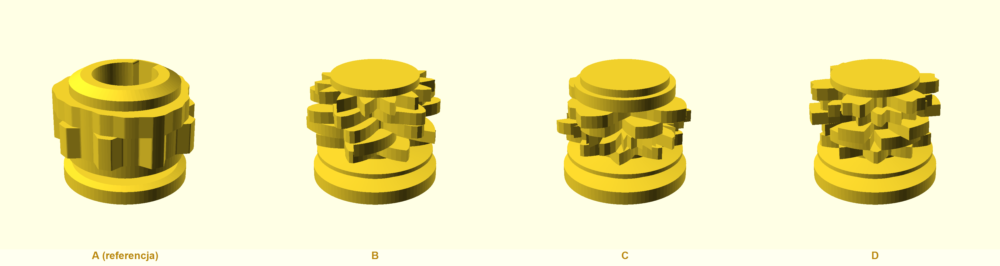
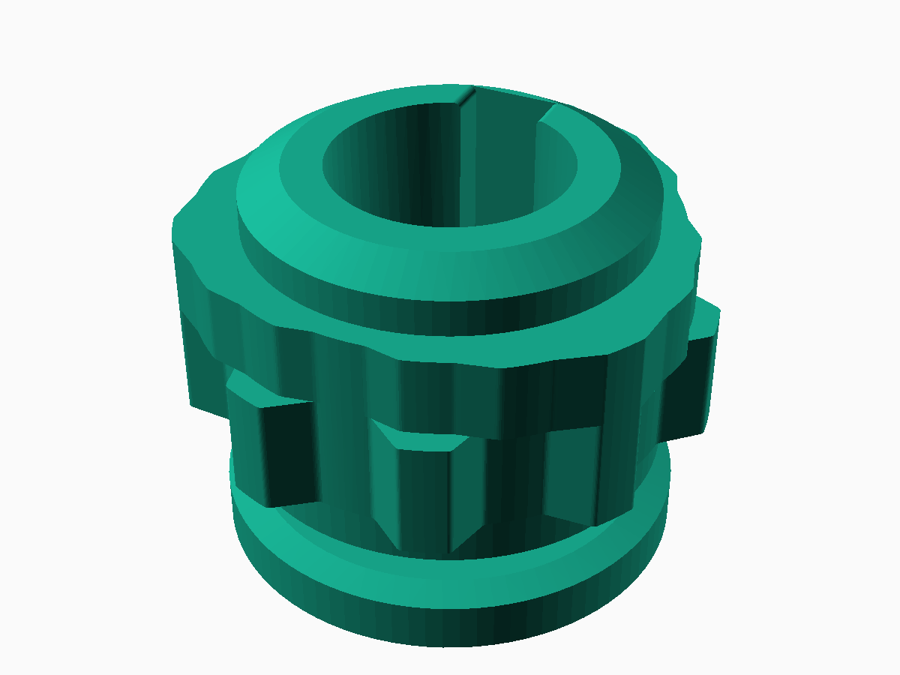
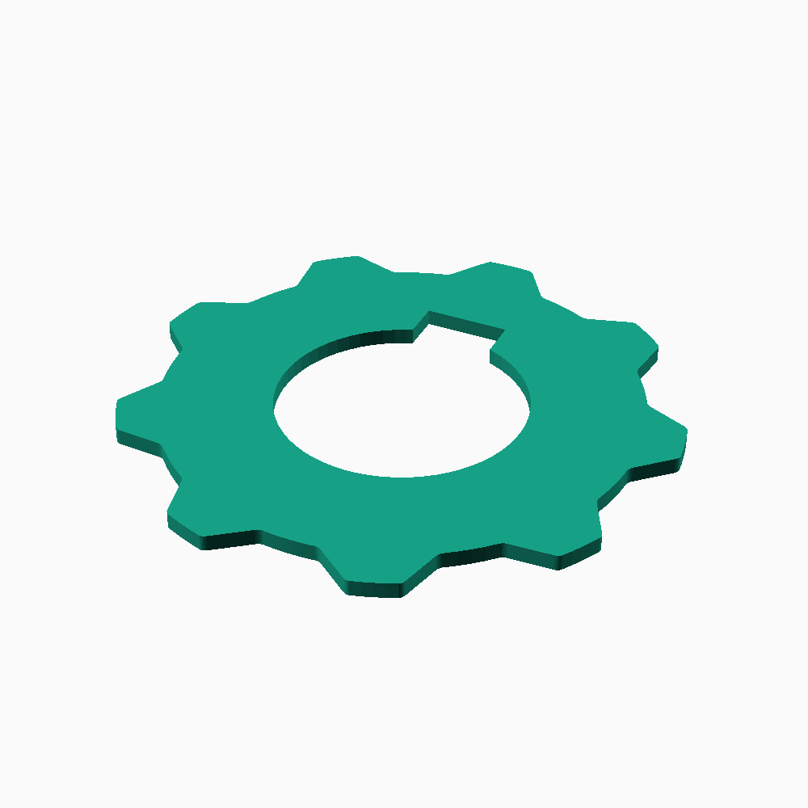
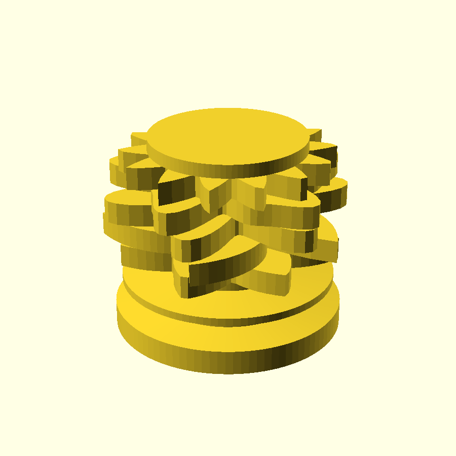
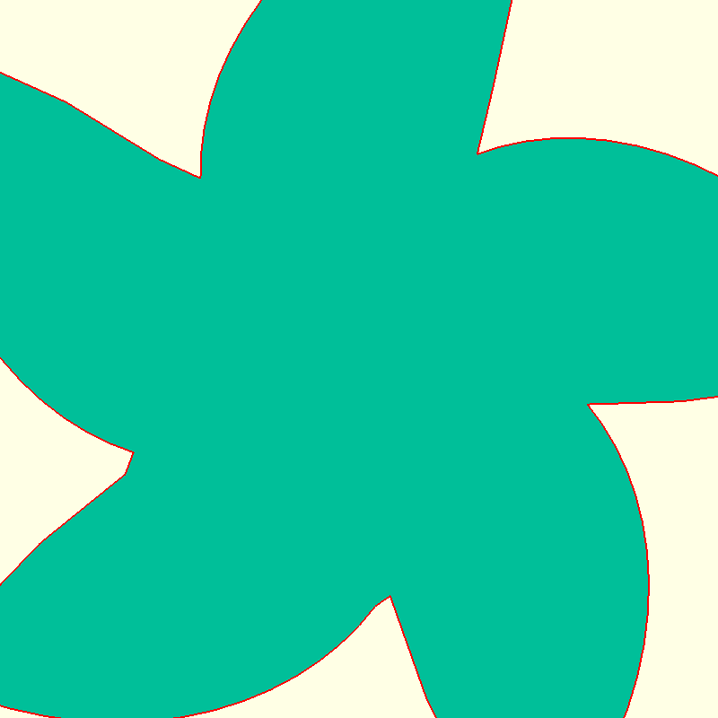
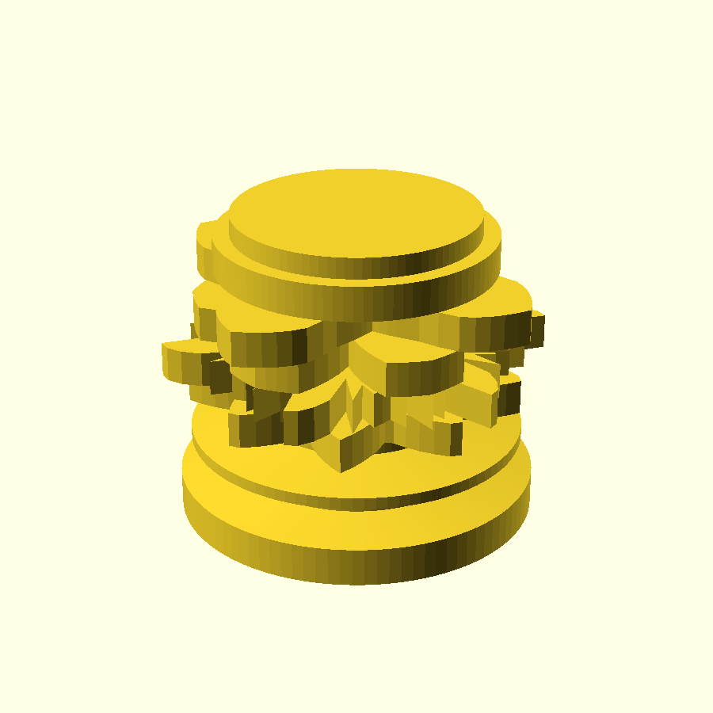
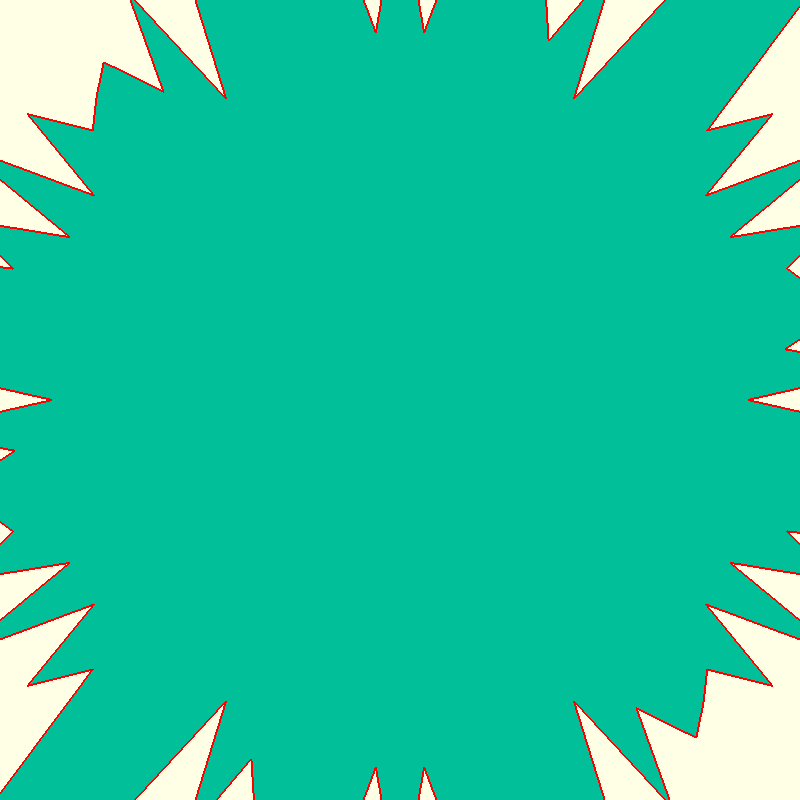
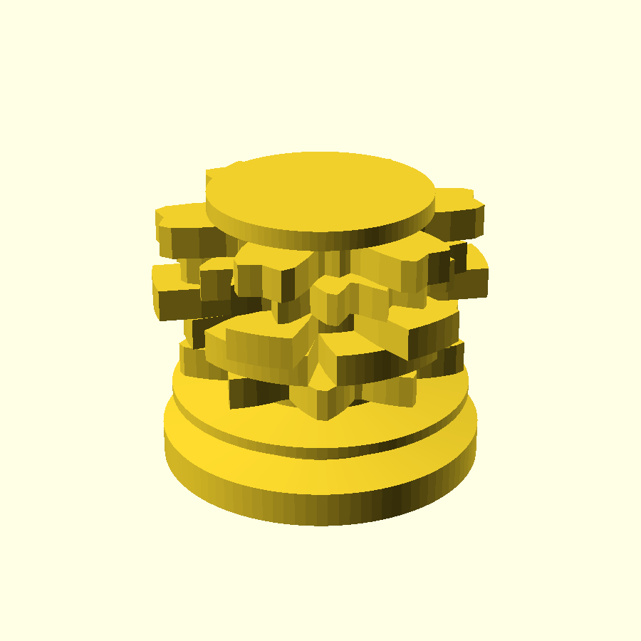
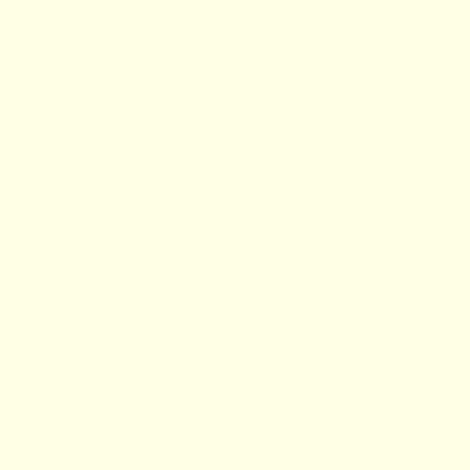

# Husqvarna Viking 21A — Cam Library (A/B/C/D)

Otwarta biblioteka krzywek (stitch cams) do maszyny **Husqvarna Viking 21A** (i modeli pokrewnych: 19, 20).

## Cel

Zestaw A jest już zaprojektowany: [Viking 21a Basic Stitch Cam](https://www.thingiverse.com/thing:6018240)
autorstwa maxkrippler — zygzak + zygzak 3-stopniowy.

Dokładna analiza pliku STL zestawu A (skan promienia co 0.1–0.25 mm wzdłuż całej długości)
pokazała, że to nie płaska tarcza, tylko **krzywka bębnowa z profilowaną krawędzią**:
- sama krawędź walca na każdej z 5 pozycji jest ukształtowana jako ząbki/profil ściegu (nie
  schowany rowek) — czujnik/popychacz maszyny jeździ bezpośrednio po tej krawędzi,
- pozycje **sąsiadują bezpośrednio, bez żadnego odstępu**,
- krzywka **nie ma otworu przelotowego na wałek** — ma za to ślepe gniazdo montażowe wycięte
  w czole dużego kołnierza oraz osobny, wieloschodkowy trzpień montażowy (kilka różnych
  średnic) między dużym kołnierzem a częścią zębatą.

Na tej podstawie odtworzono dokładne wymiary mechaniczne i zbudowano parametryczny generator
OpenSCAD do trzech kolejnych zestawów: **B, C, D** — z tą samą geometrią mocowania (schodkowy
trzpień, gniazdo, brak odstępu między pozycjami), ale nowymi, oryginalnymi wzorami ściegów
(nie odtworzeniem historii — źródeł do wiernej rekonstrukcji nie udało się znaleźć).

## Status

| Zestaw | Źródło | Status |
|---|---|---|
| A | thing:6018240 (maxkrippler) | referencyjny — plik STL przeanalizowany, wymiary spisane w `docs/DIMENSIONS.md` |
| B | oryginalny wzór "Fale i muszelki" | wygenerowany (`models/generated/cam_B.scad` + `.stl`) — **niezweryfikowany drukiem** |
| C | oryginalny wzór "Ściegi ozdobne otwarte" | wygenerowany (`models/generated/cam_C.scad` + `.stl`) — **niezweryfikowany drukiem** |
| D | oryginalny wzór "Ściegi użytkowe specjalne" | wygenerowany (`models/generated/cam_D.scad` + `.stl`) — **niezweryfikowany drukiem** |

Wzory B/C/D to **nowe, oryginalne projekty** (nie odtworzenie historii — źródeł nie udało się
znaleźć), ale z geometrią mocowania 1:1 z zestawem A. Szczegóły wyboru wzorów:
[`docs/STITCH_DESIGN.md`](docs/STITCH_DESIGN.md). Kolejny krok: wydruk próbny i ew. kalibracja
głębokości profilu (`EDGE_MAX_R`/`EDGE_MIN_R` w `cam_common.scad`) — patrz
[`docs/WORKFLOW.md`](docs/WORKFLOW.md) i [`docs/PRINTABILITY.md`](docs/PRINTABILITY.md).

## Podgląd

| | Widok izometryczny | Przekrój (pokazuje kształt ściegu) |
|---|---|---|
| **A** (referencja) |  |  |
| **B** |  |  |
| **C** |  |  |
| **D** |  |  |

Widoki izometryczne pokazują wyraźne ząbkowanie krawędzi (5 sąsiadujących ze sobą pozycji, bez
odstępu — tak jak w oryginalnym zestawie A) — przekroje pokazują dokładny kształt każdego
wzoru. Więcej widoków (z przodu) w [`docs/renders/`](docs/renders/).

## Dokumentacja

| Plik | Zawartość |
|---|---|
| [`docs/DIMENSIONS.md`](docs/DIMENSIONS.md) | Wymiary mechaniczne zmierzone z pliku STL zestawu A |
| [`docs/STITCH_DESIGN.md`](docs/STITCH_DESIGN.md) | Wybór i uzasadnienie wzorów ściegów B/C/D, kalibracja |
| [`docs/PRINTABILITY.md`](docs/PRINTABILITY.md) | Analiza drukowalności, orientacja, parametry druku |
| [`docs/USAGE.md`](docs/USAGE.md) | Montaż krzywki w maszynie, wybór ściegu, bezpieczeństwo |
| [`docs/WORKFLOW.md`](docs/WORKFLOW.md) | Jak renderować/rozwijać projekt dalej |
| [`docs/renders/`](docs/renders/) | Podglądowe renderowania (różne rzuty + zestawienie) |

## Struktura

- `models/original/` — geometria zestawu A po imporcie/analizie pliku źródłowego,
- `models/generated/` — nowe modele B, C, D,
- `references/` — skany, zdjęcia, linki źródłowe (bez wrzucania cudzych plików bez licencji),
- `docs/` — dokumentacja, status, brakujące dane, renderowania,
- `tools/openscad/` — wspólna biblioteka OpenSCAD (`cam_common.scad`) i skrypty renderujące
  (`render/`) używane do wygenerowania podglądów w `docs/renders/`.

## Projekt źródłowy (zestaw A)

https://www.thingiverse.com/thing:6018240

## Licencja

CC-BY 4.0 — patrz [`LICENSE`](LICENSE) i [`LICENSE_NOTE.md`](LICENSE_NOTE.md) (atrybucja dla
zestawu A / maxkrippler).
